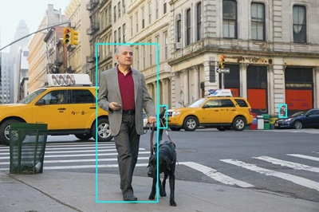

---
lab:
  title: 画像を分析する
  description: Azure AI Vision Image Analysis を使用して、画像の分析、キャプションとタグの提案、オブジェクトと人物の検出を行います。
---

# 画像を分析する

Azure AI Vision は、ソフトウェア システムが画像を分析して視覚入力を解釈できるようにする人工知能機能です。 Microsoft Azure の **Vision** Azure AI サービスは、キャプションとタグを提案する画像の分析、一般的なオブジェクトや人物の検出など、一般的な Computer Vision タスク用の構築済みモデルを提供します。 Azure AI Vision サービスを使用して背景を削除したり、画像の前景のマット処理を作成したりすることもできます。

> **注**:この演習は、変更される可能性があるプレリリース SDK ソフトウェアに基づいています。 必要に応じて、特定のバージョンのパッケージを使用しました。利用可能な最新バージョンが反映されていない可能性があります。 予期しない動作、警告、またはエラーが発生する場合があります。

この演習は、Azure Vision Python SDK に基づいていますが、次のような複数の言語固有の SDK を使用して Vision アプリケーションを開発することができます。

* [JavaScript 用 Azure AI Vision Analysis](https://www.npmjs.com/package/@azure-rest/ai-vision-image-analysis)
* [Microsoft .NET 用 Azure AI Vision Analysis](https://www.nuget.org/packages/Azure.AI.Vision.ImageAnalysis)
* [Java 用 Azure AI Vision Analysis](https://mvnrepository.com/artifact/com.azure/azure-ai-vision-imageanalysis)

この演習は約 **30** 分かかります。

## Azure AI Vision リソースをプロビジョニングする

サブスクリプションに Azure AI Vision リソースがまだない場合は、プロビジョニングする必要があります。

> **注**:この演習では、スタンドアロンの **Computer Vision** リソースを使用します。 Azure AI Vision サービスは、"Azure AI サービス" マルチサービス リソースで直接使用することも、*Azure AI Foundry* プロジェクトで使用することもできます。**

1. [Azure portal](https://portal.azure.com) (`https://portal.azure.com`) を開き、Azure 資格情報を使用してサインインします。 表示されているすべてのウェルカム メッセージまたはヒントを閉じます。
1. **[リソースの作成]** を選択します。
1. 検索バーで `Computer Vision` を検索し、**[Computer Vision]** を選択して、次の設定でリソースを作成します。
    - **[サブスクリプション]**:"*ご自身の Azure サブスクリプション*"
    - **リソース グループ**: *リソース グループを作成または選択します*
    - **[リージョン]**: **米国東部**、**米国西部**、**フランス中部**、**韓国中部**、**北ヨーロッパ**、**東南アジア**、**西ヨーロッパ**、**東アジア**から選択します\***
    - **[名前]**: Computer Vision リソースの有効な名前**
    - **価格レベル**: Free F0

    \*Azure AI Vision 4.0 の機能は、現在、これらのリージョンでのみ使用できます。

1. 必要なチェック ボックスをオンにして、リソースを作成します。
1. デプロイが完了するまで待ち、デプロイの詳細を表示します。
1. リソースがデプロイされたら、そのリソースに移動します。ナビゲーション ウィンドウの **[リソース管理]** ノードの下に、そのリソースの **[キーとエンドポイント]** ページが表示されます。 次の手順では、このページのエンドポイントとキーの 1 つが必要になります。

## Azure AI Vision SDK を使用して画像分析アプリを開発する

この演習では、Azure AI Vision SDK を使用して画像を分析する、部分的に実装されたクライアント アプリケーションを完成させます。

### アプリケーション構成を準備する

1. Azure portal で、ページ上部の検索バーの右側にある **[\>_]** ボタンを使用して、Azure portal に新しい Cloud Shell を作成し、サブスクリプションにストレージがない ***PowerShell*** 環境を選択します。

    Azure portal の下部にあるペインに Cloud Shell のコマンド ライン インターフェイスが表示されます。

    > **注**: *Bash* 環境を使用するクラウド シェルを以前に作成した場合は、それを ***PowerShell*** に切り替えます。

    > **注**:ポータルで、ファイルを保持するストレージを選択するように求められた場合は、**[ストレージ アカウントは不要です]** を選択し、お使いのサブスクリプションを選択して、**[適用]** を選択します。

1. Cloud Shell ツール バーの **[設定]** メニューで、**[クラシック バージョンに移動]** を選択します (これはコード エディターを使用するのに必要です)。

    **<font color="red">続行する前に、クラシック バージョンの Cloud Shell に切り替えたことを確認します。</font>**

1. Cloud Shell ペインのサイズを変更すると、Computer Vision リソースの **[キーとエンドポイント]** ページを引き続き表示できます。

    > **ヒント**" 上部の境界線をドラッグすると、ペインのサイズを変更できます。 最小化ボタンと最大化ボタンを使用して、Cloud Shell とメイン ポータル インターフェイスを切り替えることもできます。

1. Cloud Shell 画面で、次のコマンドを入力して、この演習のコード ファイルを含む GitHub リポジトリをクローンします (コマンドを入力するか、クリップボードにコピーしてから、コマンド ラインで右クリックし、プレーンテキストとして貼り付けます)。

    ```
    rm -r mslearn-ai-vision -f
    git clone https://github.com/MicrosoftLearning/mslearn-ai-vision
    ```

    > **ヒント**: Cloudshell にコマンドを貼り付けると、出力が大量のスクリーン バッファーを占有する可能性があります。 `cls` コマンドを入力して、各タスクに集中しやすくすることで、スクリーンをクリアできます。

1. リポジトリがクローンされたら、次のコマンドを使用して、アプリケーション コード ファイルが含まれているフォルダーに移動して表示します。   

    ```
   cd mslearn-ai-vision/Labfiles/analyze-images/python/image-analysis
   ls -a -l
    ```

    このフォルダーには、アプリのアプリケーション構成ファイルとコード ファイルが含まれています。 また、**/images** サブフォルダーも含まれています。これには、アプリで分析するいくつかの画像ファイルが含まれています。
    
1. 次のコマンドを実行して、Azure AI Vision SDK パッケージとその他の必要なパッケージをインストールします。

    ```
   python -m venv labenv
   ./labenv/bin/Activate.ps1
   pip install -r requirements.txt azure-ai-vision-imageanalysis==1.0.0
    ```

1. 次のコマンドを入力して、アプリの構成ファイルを編集します。

    ```
   code .env
    ```

    このファイルをコード エディターで開きます。

1. コード ファイルで、含まれている構成値を更新して、Computer Vision リソースの**エンドポイント**と認証**キー** (Azure portal の **[キーとエンドポイント]** ページからコピー) を反映します。
1. プレースホルダーを置き換えたら、**Ctrl + S** キー コマンドを使用して変更を保存してから、**Ctrl + Q** キー コマンドを使用して、Cloud Shell コマンド ラインを開いたままコード エディターを閉じます。

### キャプションを提案するコードを追加する

1. Cloud Shell コマンド ラインで、次のコマンドを入力して、クライアント アプリケーションのコード ファイルを開きます。

    ```
   code image-analysis.py
    ```

    > **ヒント**: Cloud Shell ペインを最大化し、コマンド ライン コンソールとコード エディターの間で分割バーを移動すると、コードをより簡単に表示できます。

1. コード ファイルで、**Import namespaces** というコメントを見つけて、Azure AI Vision SDK を使用するために必要な名前空間をインポートする次のコードを追加します。

    ```python
   # import namespaces
   from azure.ai.vision.imageanalysis import ImageAnalysisClient
   from azure.ai.vision.imageanalysis.models import VisualFeatures
   from azure.core.credentials import AzureKeyCredential
    ```

1. **Main** 関数には、構成設定を読み込み、分析する画像ファイルを決定するためのコードが提供されていることに注意してください。 次に、**Authenticate Azure AI Vision client** というコメントを見つけて、Azure AI Vision クライアント オブジェクトを作成して認証する次のコードを追加します (正しいインデント レベルを維持してください)。

    ```python
   # Authenticate Azure AI Vision client
   cv_client = ImageAnalysisClient(
        endpoint=ai_endpoint,
        credential=AzureKeyCredential(ai_key))
    ```

1. **Main** 関数に追加したコードの下で、**Analyze image** というコメントを見つけて、次のコードを追加します。

    ```python
   # Analyze image
   with open(image_file, "rb") as f:
        image_data = f.read()
   print(f'\nAnalyzing {image_file}\n')

   result = cv_client.analyze(
        image_data=image_data,
        visual_features=[
            VisualFeatures.CAPTION,
            VisualFeatures.DENSE_CAPTIONS,
            VisualFeatures.TAGS,
            VisualFeatures.OBJECTS,
            VisualFeatures.PEOPLE],
   )
    ```

1. **Get image captions** というコメントを見つけて、画像のキャプションと高密度キャプションを表示する次のコードを追加します。

    ```python
   # Get image captions
   if result.caption is not None:
        print("\nCaption:")
        print(" Caption: '{}' (confidence: {:.2f}%)".format(result.caption.text, result.caption.confidence * 100))
    
   if result.dense_captions is not None:
        print("\nDense Captions:")
        for caption in result.dense_captions.list:
            print(" Caption: '{}' (confidence: {:.2f}%)".format(caption.text, caption.confidence * 100))
    ```

1. 変更を保存し (*Ctrl + S* キー)、ペインのサイズを変更して、コード エディターを開いたままコマンド ライン コンソールがよく見えるようにします。 その後、次のコマンドを入力して、引数 **images/street.jpg** を使用してプログラムを実行します。

    ```
   python image-analysis.py images/street.jpg
    ```

1. 出力を観察します。これには、次のような **street.jpg** 画像の推奨キャプションが含まれているはずです。

    

1. 今度は引数 **images/building.jpg** を使用してプログラムを再度実行し、**building.jpg** 画像に対して生成されるキャプションを確認します。これは次のようになります。

    

1. 前の手順を繰り返して、**images/person.jpg** ファイルのキャプションを生成します。次のようになります。

    

### 推奨タグを生成するコードを追加する

画像の内容に関する手がかりを提供する関連*タグ*を特定すると役立つ場合があります。

1. コード エディターで、**AnalyzeImage** 関数の **Get image tags** というコメントを見つけて、次のコードを追加します。

    ```python
   # Get image tags
   if result.tags is not None:
        print("\nTags:")
        for tag in result.tags.list:
            print(" Tag: '{}' (confidence: {:.2f}%)".format(tag.name, tag.confidence * 100))
    ```

1. 変更を保存し (*Ctrl + S* キー)、引数 **images/street.jpg** を使用してプログラムを実行します。画像のキャプションに加えて、推奨タグのリストが表示されることを確認します。
1. **images/building.jpg** および **images/person.jpg** ファイルに対してプログラムを再実行します。

### オブジェクトを検出して特定するコードを追加する

1. コード エディターで、**AnalyzeImage** 関数のコメント **Get objects in the image** を見つけて、次のコードを追加します。これにより、画像で検出されたオブジェクトを一覧表示し、指定した関数を呼び出して、オブジェクトが検出された画像に注釈を付けます。

    ```python
   # Get objects in the image
   if result.objects is not None:
        print("\nObjects in image:")
        for detected_object in result.objects.list:
            # Print object tag and confidence
            print(" {} (confidence: {:.2f}%)".format(detected_object.tags[0].name, detected_object.tags[0].confidence * 100))
        # Annotate objects in the image
        show_objects(image_file, result.objects.list)
    ```

1. 変更を保存し (*Ctrl + S* キー)、引数 **images/street.jpg** を使用してプログラムを実行します。画像キャプションと推奨タグに加えて、**objects.jpg** という名前のファイルが生成されていることを確認します。
1. (Azure Cloud Shell 固有の) **download** コマンドを使用して、**objects.jpg** ファイルをダウンロードします。

    ```
   download objects.jpg
    ```

    ダウンロード コマンドを実行すると、ブラウザーの右下にポップアップ リンクが作成され、ここからファイルをダウンロードして開くことができます。 画像は次のようになります。

    

1. **images/building.jpg** および **images/person.jpg** ファイルに対してプログラムを再実行し、それぞれの実行後に生成された objects.jpg ファイルをダウンロードします。

### 人物を検出して特定するコードを追加する

1. コード エディターで、**AnalyzeImage** 関数のコメント **Get people in the image** を見つけ、次のコードを追加します。これにより、信頼度 20% 以上で検出された人物を一覧表示し、指定した関数を呼び出して画像内で注釈を付けます。

    ```Python
   # Get people in the image
   if result.people is not None:
        print("\nPeople in image:")

        for detected_person in result.people.list:
            if detected_person.confidence > 0.2:
                # Print location and confidence of each person detected
                print(" {} (confidence: {:.2f}%)".format(detected_person.bounding_box, detected_person.confidence * 100))
        # Annotate people in the image
        show_people(image_file, result.people.list)
    ```

1. 変更を保存し (*Ctrl + S* キー)、引数 **images/street.jpg** を使用してプログラムを実行して、画像キャプション、推奨タグ、objects.jpg ファイルに加えて、人物の場所のリストと **people.jpg** という名前のファイルが生成されていることを確認します。

1. (Azure Cloud Shell 固有の) **download** コマンドを使用して、**objects.jpg** ファイルをダウンロードします。

    ```
   download people.jpg
    ```

    ダウンロード コマンドを実行すると、ブラウザーの右下にポップアップ リンクが作成され、ここからファイルをダウンロードして開くことができます。 画像は次のようになります。

    

1. **images/building.jpg** および **images/person.jpg** ファイルに対してプログラムを再実行し、それぞれの実行後に生成された people.jpg ファイルをダウンロードします。

   > **ヒント:** モデルから返された境界ボックスが意味をなさない場合は、JSON 信頼度スコアを確認し、アプリで信頼度スコアのフィルター処理を増やしてみてください。

## リソースをクリーンアップする

Azure AI Vision を調べ終えたら、不要な Azure コストが発生しないように、この演習で作成したリソースを削除する必要があります。

1. Azure portal (`https://portal.azure.com`) を開き、ご利用の Azure サブスクリプションに関連付けられている Microsoft アカウントを使用してサインインします。

1. 上部の検索バーで *Computer Vision* を検索し、このラボで作成した Computer Vision リソースを選択します。

1. [リソース] ページで **[削除]** を選択し、指示に従ってリソースを削除します。

