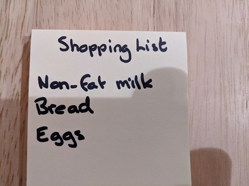

---
lab:
  title: 画像内のテキストの読み取り
  description: Azure AI Vision Image Analysis サービスで光学式文字認識 (OCR) を使用して、画像内のテキストを特定して抽出します。
---

# 画像内のテキストの読み取り

光学式文字認識 (OCR) は、画像およびドキュメント内のテキストの読み取りを処理する Computer Vision のサブセットです。 **Azure AI Vision** Image Analysis サービスには、テキストを読み取るための API が用意されています。これについて、この演習で調査します。

> **注**:この演習は、変更される可能性があるプレリリース SDK ソフトウェアに基づいています。 必要に応じて、特定のバージョンのパッケージを使用しました。利用可能な最新バージョンが反映されていない可能性があります。 予期しない動作、警告、またはエラーが発生する場合があります。

この演習は、Azure Vision Analysis Python SDK に基づいていますが、次のような複数の言語固有の SDK を使用して Vision アプリケーションを開発することができます。

* [JavaScript 用 Azure AI Vision Analysis](https://www.npmjs.com/package/@azure-rest/ai-vision-image-analysis)
* [Microsoft .NET 用 Azure AI Vision Analysis](https://www.nuget.org/packages/Azure.AI.Vision.ImageAnalysis)
* [Java 用 Azure AI Vision Analysis](https://mvnrepository.com/artifact/com.azure/azure-ai-vision-imageanalysis)

この演習は約 **30** 分かかります。

## Azure AI Vision リソースをプロビジョニングする

サブスクリプションに Azure AI Vision リソースがまだない場合は、プロビジョニングする必要があります。

> **注**:この演習では、スタンドアロンの **Computer Vision** リソースを使用します。 Azure AI Vision サービスは、"Azure AI サービス" マルチサービス リソースで直接使用することも、*Azure AI Foundry* プロジェクトで使用することもできます。**

1. [Azure portal](https://portal.azure.com) (`https://portal.azure.com`) を開き、Azure 資格情報を使用してサインインします。 表示されているすべてのウェルカム メッセージまたはヒントを閉じます。
1. **[リソースの作成]** を選択します。
1. 検索バーで `Computer Vision` を検索し、**[Computer Vision]** を選択して、次の設定でリソースを作成します。
    - **[サブスクリプション]**:"*ご自身の Azure サブスクリプション*"
    - **リソース グループ**: *リソース グループを作成または選択します*
    - **[リージョン]**: **米国東部**、**米国西部**、**フランス中部**、**韓国中部**、**北ヨーロッパ**、**東南アジア**、**西ヨーロッパ**、**東アジア**から選択します\***
    - **[名前]**: Computer Vision リソースの有効な名前**
    - **価格レベル**: Free F0

    \*Azure AI Vision 4.0 の機能は、現在、これらのリージョンでのみ使用できます。

1. 必要なチェック ボックスをオンにして、リソースを作成します。
1. デプロイが完了するまで待ち、デプロイの詳細を表示します。
1. リソースがデプロイされたら、そのリソースに移動します。ナビゲーション ウィンドウの **[リソース管理]** ノードの下に、そのリソースの **[キーとエンドポイント]** ページが表示されます。 次の手順では、このページのエンドポイントとキーの 1 つが必要になります。

## Azure AI Vision SDK を使用してテキスト抽出アプリを開発する

この演習では、Azure AI Vision SDK を使用して画像からテキストを抽出する部分的に実装されたクライアント アプリケーションを完成させます。

### アプリケーション構成を準備する

1. Azure portal で、ページ上部の検索バーの右側にある **[\>_]** ボタンを使用して、Azure portal に新しい Cloud Shell を作成し、サブスクリプションにストレージがない ***PowerShell*** 環境を選択します。

    Azure portal の下部にあるペインに Cloud Shell のコマンド ライン インターフェイスが表示されます。

    > **注**: *Bash* 環境を使用するクラウド シェルを以前に作成した場合は、それを ***PowerShell*** に切り替えます。

    > **注**:ポータルで、ファイルを保持するストレージを選択するように求められた場合は、**[ストレージ アカウントは不要です]** を選択し、お使いのサブスクリプションを選択して、**[適用]** を選択します。

1. Cloud Shell ツール バーの **[設定]** メニューで、**[クラシック バージョンに移動]** を選択します (これはコード エディターを使用するのに必要です)。

    **<font color="red">続行する前に、クラシック バージョンの Cloud Shell に切り替えたことを確認します。</font>**

1. Cloud Shell ペインのサイズを変更すると、Computer Vision リソースの **[キーとエンドポイント]** ページを引き続き表示できます。

    > **ヒント**" 上部の境界線をドラッグすると、ペインのサイズを変更できます。 最小化ボタンと最大化ボタンを使用して、Cloud Shell とメイン ポータル インターフェイスを切り替えることもできます。

1. Cloud Shell 画面で、次のコマンドを入力して、この演習のコード ファイルを含む GitHub リポジトリをクローンします (コマンドを入力するか、クリップボードにコピーしてから、コマンド ラインで右クリックし、プレーンテキストとして貼り付けます)。

    ```
    rm -r mslearn-ai-vision -f
    git clone https://github.com/MicrosoftLearning/mslearn-ai-vision
    ```

    > **ヒント**: Cloudshell にコマンドを貼り付けると、出力が大量のスクリーン バッファーを占有する可能性があります。 `cls` コマンドを入力して、各タスクに集中しやすくすることで、スクリーンをクリアできます。

1. リポジトリがクローンされたら、次のコマンドを使用して、アプリケーション コード ファイルに移動します。

    ```
   cd mslearn-ai-vision/Labfiles/ocr/python/read-text
   ls -a -l
    ```

    このフォルダーには、アプリのアプリケーション構成ファイルとコード ファイルが含まれています。 また、**/images** サブフォルダーも含まれています。これには、アプリで分析するいくつかの画像ファイルが含まれています。

1. 次のコマンドを実行して、Azure AI Vision SDK パッケージとその他の必要なパッケージをインストールします。

    ```
   python -m venv labenv
   ./labenv/bin/Activate.ps1
   pip install -r requirements.txt azure-ai-vision-imageanalysis==1.0.0
    ```

1. 次のコマンドを入力して、アプリの構成ファイルを編集します。

    ```
   code .env
    ```

    このファイルをコード エディターで開きます。

1. コード ファイルで、含まれている構成値を更新して、Computer Vision リソースの**エンドポイント**と認証**キー** (Azure portal の **[キーとエンドポイント]** ページからコピー) を反映します。
1. プレースホルダーを置き換えたら、**Ctrl + S** キー コマンドを使用して変更を保存してから、**Ctrl + Q** キー コマンドを使用して、Cloud Shell コマンド ラインを開いたままコード エディターを閉じます。

### 画像からテキストを読み取るコードを追加する

1. Cloud Shell コマンド ラインで、次のコマンドを入力して、クライアント アプリケーションのコード ファイルを開きます。

    ```
   code read-text.py
    ```

    > **ヒント**: Cloud Shell ペインを最大化し、コマンド ライン コンソールとコード エディターの間で分割バーを移動すると、コードをより簡単に表示できます。

1. コード ファイルで、**Import namespaces** というコメントを見つけて、Azure AI Vision SDK を使用するために必要な名前空間をインポートする次のコードを追加します。

    ```python
   # import namespaces
   from azure.ai.vision.imageanalysis import ImageAnalysisClient
   from azure.ai.vision.imageanalysis.models import VisualFeatures
   from azure.core.credentials import AzureKeyCredential
    ```

1. **Main** 関数で、構成設定を読み込み、分析するファイルを決定するためのコードが提供されています。 次に、**Authenticate Azure AI Vision client** というコメントを見つけ、Azure AI Vision Image Analysis クライアント オブジェクトを作成して認証する次の言語固有のコードを追加します。

    ```python
   # Authenticate Azure AI Vision client
   cv_client = ImageAnalysisClient(
        endpoint=ai_endpoint,
        credential=AzureKeyCredential(ai_key))
    ```

1. **Main** 関数に追加したコードの下で、**Read text in image** というコメントを見つけて、Image Analysis クライアントを使用して画像内のテキストを読み取る次のコードを追加します。

    ```python
   # Read text in image
   with open(image_file, "rb") as f:
        image_data = f.read()
   print (f"\nReading text in {image_file}")

   result = cv_client.analyze(
        image_data=image_data,
        visual_features=[VisualFeatures.READ])
    ```

1. **Print the text** というコメントを見つけ、次のコードを (最後のコメントを含めて) 追加します。これにより、見つかったテキスト行を出力し、関数を呼び出して画像内で注釈を付けます (各テキスト行に返される **bounding_polygon** を使用)。

    ```python
   # Print the text
   if result.read is not None:
        print("\nText:")
    
        for line in result.read.blocks[0].lines:
            print(f" {line.text}")        
        # Annotate the text in the image
        annotate_lines(image_file, result.read)

        # Find individual words in each line
        
    ```

1. 変更を保存しますが (*Ctrl + S* キー)、入力ミスを修正する必要がある場合に備えて、コード エディターは開いたままにしておきます。

1. コンソールのより多くの部分を表示できるようにペインのサイズを変更し、次のコマンドを入力してプログラムを実行します。

    ```
   python read-text.py images/Lincoln.jpg
    ```

1. プログラムは、指定された画像ファイル (*images/Lincoln.jpg*) 内の次のようなテキストを読み取ります。

    

1. **read-text** フォルダーに **lines.jpg** 画像が作成されています。 (Azure Cloud Shell 固有の) **download** コマンドを使用して、それをダウンロードします。

    ```
   download lines.jpg
    ```

    ダウンロード コマンドを実行すると、ブラウザーの右下にポップアップ リンクが作成され、ここからファイルをダウンロードして開くことができます。 次のような画像が表示されます。

    

1. プログラムをもう一度実行します。今度は、パラメーター *images/Business-card.jpg* を指定して、次の画像からテキストを抽出します。

    

    ```
   python read-text.py images/Business-card.jpg
    ```

1. その結果生成された **lines.jpg** ファイルをダウンロードして表示します。

    ```
   download lines.jpg
    ```

1. プログラムをもう一度実行します。今度は、パラメーター *images/Note.jpg* を指定して、この画像からテキストを抽出します。

    

    ```
   python read-text.py images/Note.jpg
    ```

1. その結果生成された **lines.jpg** ファイルをダウンロードして表示します。

    ```
   download lines.jpg
    ```

### 個々の単語の位置を返すコードを追加する

1. コード ファイルのより多くの部分を表示できるようにペインのサイズを変更します。 次に、**Find individual words in each line** というコメントを見つけて、次のコードを追加します (正しいインデント レベルを維持するように注意してください)。

    ```python
   # Find individual words in each line
   print ("\nIndividual words:")
   for line in result.read.blocks[0].lines:
        for word in line.words:
            print(f"  {word.text} (Confidence: {word.confidence:.2f}%)")
   # Annotate the words in the image
   annotate_words(image_file, result.read)
    ```

1. 変更を保存します (*Ctrl + S* キー)。 次に、コマンド ライン ペインでプログラムを再実行して、*images/Lincoln.jpg* からテキストを抽出します。
1. 出力を確認します。画像内の個々の単語と、その予測に関連付けられた信頼度が含まれています。
1. **read-text** フォルダーに **words.jpg** 画像が作成されています。 (Azure Cloud Shell 固有の) **download** コマンドを使用して、それをダウンロードして表示します。

    ```
   download words.jpg
    ```

1. *images/Business-card.jpg* と *images/Note.jpg* に対してプログラムを再実行し、各画像に対して生成された **words.jpg** ファイルを表示します。

## リソースをクリーンアップする

Azure AI Vision を調べ終えたら、不要な Azure コストが発生しないように、この演習で作成したリソースを削除する必要があります。

1. Azure portal (`https://portal.azure.com`) を開き、ご利用の Azure サブスクリプションに関連付けられている Microsoft アカウントを使用してサインインします。

1. 上部の検索バーで *Computer Vision* を検索し、このラボで作成した Computer Vision リソースを選択します。

1. [リソース] ページで **[削除]** を選択し、指示に従ってリソースを削除します。
