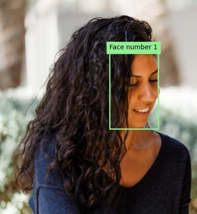

---
lab:
  title: 顔を検出して分析する
  description: Azure AI Vision Face サービスを使用して顔の検出と分析のソリューションを実装します。
---

# 顔を検出して分析する

人間の顔を検出して分析する機能は、AI のコア機能です。 この演習では、顔を操作する **Face** サービスを調べます。

> **注**:この演習は、変更される可能性があるプレリリース SDK ソフトウェアに基づいています。 必要に応じて、特定のバージョンのパッケージを使用しました。利用可能な最新バージョンが反映されていない可能性があります。 予期しない動作、警告、またはエラーが発生する場合があります。

この演習は、Azure Vision Face Python SDK に基づいていますが、次のような複数の言語固有の SDK を使用して Vision アプリケーションを開発することができます。

* [Azure AI Vision Face for JavaScript](https://www.npmjs.com/package/@azure-rest/ai-vision-face)
* [Azure AI Vision Face for Microsoft .NET](https://www.nuget.org/packages/Azure.AI.Vision.Face)
* [Azure AI Vision Face for Java](https://central.sonatype.com/artifact/com.azure/azure-ai-vision-face)

この演習は約 **30** 分かかります。

> **注**:個人を特定できる情報を返す Azure AI サービスの機能は、[制限付きアクセス](https://learn.microsoft.com/legal/cognitive-services/computer-vision/limited-access-identity)が許可されているお客様に限定されます。 この演習には顔認識タスクは含まれていないため、制限付き機能への追加アクセスを要求せずに完了できます。

## Azure AI Face API リソースをプロビジョニングする

サブスクリプションに Azure AI Face API リソースがまだない場合は、プロビジョニングする必要があります。

> **注**:この演習では、スタンドアロンの **Face** リソースを使用します。 Azure AI Face サービスは、"Azure AI サービス" マルチサービス リソースで直接使用することも、*Azure AI Foundry* プロジェクトで使用することもできます。**

1. [Azure portal](https://portal.azure.com) (`https://portal.azure.com`) を開き、Azure 資格情報を使用してサインインします。 表示されているすべてのウェルカム メッセージまたはヒントを閉じます。
1. **[リソースの作成]** を選択します。
1. 検索バーで `Face` を検索し、**[Face]** を選択して、次の設定でリソースを作成します。
    - **[サブスクリプション]**:"*ご自身の Azure サブスクリプション*"
    - **リソース グループ**: *リソース グループを作成または選択します*
    - **[リージョン]**: *使用できるリージョンを選択します*
    - **[名前]**: "Face リソースの有効な名前"**
    - **価格レベル**: Free F0

1. リソースを作成し、デプロイが完了するまで待ってから、デプロイの詳細を表示します。
1. リソースがデプロイされたら、そのリソースに移動します。ナビゲーション ウィンドウの **[リソース管理]** ノードの下に、そのリソースの **[キーとエンドポイント]** ページが表示されます。 次の手順では、このページのエンドポイントとキーの 1 つが必要になります。

## Face SDK を使用して顔分析アプリを開発する

この演習では、Azure Face SDK を使用して画像内の人間の顔を検出して分析するクライアント アプリケーションが部分的に実装されていますが、その実装を完成させます。

### アプリケーション構成を準備する

1. Azure portal で、ページ上部の検索バーの右側にある **[\>_]** ボタンを使用して、Azure portal に新しい Cloud Shell を作成し、サブスクリプションにストレージがない ***PowerShell*** 環境を選択します。

    Azure portal の下部にあるペインに Cloud Shell のコマンド ライン インターフェイスが表示されます。

    > **注**: *Bash* 環境を使用するクラウド シェルを以前に作成した場合は、それを ***PowerShell*** に切り替えます。

    > **注**:ファイルを保持するストレージを選択するようにポータルから求められた場合は、**[ストレージ アカウントは不要です]** を選択し、お使いのサブスクリプションを選択して、**[適用]** を選択します。

1. Cloud Shell ツール バーの **[設定]** メニューで、**[クラシック バージョンに移動]** を選択します (これはコード エディターを使用するのに必要です)。

    **<font color="red">続行する前に、クラシック バージョンの Cloud Shell に切り替えたことを確認します。</font>**

1. Cloud Shell ペインのサイズを変更すると、Face リソースの **[キーとエンドポイント]** ページを引き続き表示できます。

    > **ヒント**" 上部の境界線をドラッグすると、ペインのサイズを変更できます。 最小化ボタンと最大化ボタンを使用して、Cloud Shell とメイン ポータル インターフェイスを切り替えることもできます。

1. Cloud Shell 画面で、次のコマンドを入力して、この演習のコード ファイルを含む GitHub リポジトリをクローンします (コマンドを入力するか、クリップボードにコピーしてから、コマンド ラインで右クリックし、プレーンテキストとして貼り付けます)。

    ```
    rm -r mslearn-ai-vision -f
    git clone https://github.com/MicrosoftLearning/mslearn-ai-vision
    ```

    > **ヒント**: Cloudshell にコマンドを貼り付けると、出力が大量のスクリーン バッファーを占有する可能性があります。 `cls` コマンドを入力して、各タスクに集中しやすくすることで、スクリーンをクリアできます。

1. リポジトリが複製されたら、次のコマンドを使用してアプリケーション コード ファイルに移動します。

    ```
   cd mslearn-ai-vision/Labfiles/face/python/face-api
   ls -a -l
    ```

    このフォルダーには、アプリのアプリケーション構成ファイルとコード ファイルが含まれています。 また、**/images** サブフォルダーも含まれています。これは、アプリで分析するいくつかの画像ファイルが含まれています。

1. 次のコマンドを実行して、Azure AI Vision SDK とその他の必要なパッケージをインストールします。

    ```
   python -m venv labenv
   ./labenv/bin/Activate.ps1
   pip install -r requirements.txt azure-ai-vision-face==1.0.0b2
    ```

1. 次のコマンドを入力して、アプリの構成ファイルを編集します。

    ```
   code .env
    ```

    このファイルをコード エディターで開きます。

1. コード ファイルで、含まれている構成値を更新して、Face リソースの**エンドポイント**と認証**キー** (Azure portal の **[キーとエンドポイント]** ページからコピー) を反映します。
1. プレースホルダーを置き換えたら、**Ctrl + S** キー コマンドを使用して変更を保存してから、**Ctrl + Q** キー コマンドを使用して、Cloud Shell コマンド ラインを開いたままコード エディターを閉じます。

### Face API クライアントを作成するコードを追加する

1. Cloud Shell コマンド ラインで、次のコマンドを入力して、クライアント アプリケーションのコード ファイルを開きます。

    ```
   code analyze-faces.py
    ```

    > **ヒント**: Cloud Shell ペインを最大化し、コマンド ライン コンソールとコード エディターの間で分割バーを移動すると、コードをより簡単に表示できます。

1. コード ファイルで、**Import namespaces** というコメントを見つけて、Azure AI Vision SDK を使用するために必要な名前空間をインポートする次のコードを追加します。

    ```python
   # Import namespaces
   from azure.ai.vision.face import FaceClient
   from azure.ai.vision.face.models import FaceDetectionModel, FaceRecognitionModel, FaceAttributeTypeDetection01
   from azure.core.credentials import AzureKeyCredential
    ```

1. **Main** 関数には、構成設定を読み込み、分析する画像を決定するためのコードが提供されていることに注意してください。 次に、**Authenticate Face client** というコメントを見つけて、**FaceClient** オブジェクトを作成して認証する次のコードを追加します。

    ```python
   # Authenticate Face client
   face_client = FaceClient(
        endpoint=cog_endpoint,
        credential=AzureKeyCredential(cog_key))
    ```

### 顔を検出して分析するコードを追加する

1. アプリケーションのコード ファイル内の **Main** 関数で、**Specify facial features to be retrieved** というコメントを見つけて、次のコードを追加します。

    ```python
   # Specify facial features to be retrieved
   features = [FaceAttributeTypeDetection01.HEAD_POSE,
                FaceAttributeTypeDetection01.OCCLUSION,
                FaceAttributeTypeDetection01.ACCESSORIES]
    ```

1. **Main**関数で、追加したばかりのコードの下で、**Get faces** というコメントを見つけて、次のコードを追加します。これは、顔の特徴情報を出力し、(各顔の **face_rectangle** プロパティに基づいて) 検出された各顔の境界ボックスで画像に注釈を付ける関数を呼び出します。

    ```Python
   # Get faces
   with open(image_file, mode="rb") as image_data:
        detected_faces = face_client.detect(
            image_content=image_data.read(),
            detection_model=FaceDetectionModel.DETECTION01,
            recognition_model=FaceRecognitionModel.RECOGNITION01,
            return_face_id=False,
            return_face_attributes=features,
        )

   face_count = 0
   if len(detected_faces) > 0:
        print(len(detected_faces), 'faces detected.')
        for face in detected_faces:
    
            # Get face properties
            face_count += 1
            print('\nFace number {}'.format(face_count))
            print(' - Head Pose (Yaw): {}'.format(face.face_attributes.head_pose.yaw))
            print(' - Head Pose (Pitch): {}'.format(face.face_attributes.head_pose.pitch))
            print(' - Head Pose (Roll): {}'.format(face.face_attributes.head_pose.roll))
            print(' - Forehead occluded?: {}'.format(face.face_attributes.occlusion["foreheadOccluded"]))
            print(' - Eye occluded?: {}'.format(face.face_attributes.occlusion["eyeOccluded"]))
            print(' - Mouth occluded?: {}'.format(face.face_attributes.occlusion["mouthOccluded"]))
            print(' - Accessories:')
            for accessory in face.face_attributes.accessories:
                print('   - {}'.format(accessory.type))
            # Annotate faces in the image
            annotate_faces(image_file, detected_faces)
    ```

1. **Main** 関数に追加したコードを調べます。 これは、画像ファイルを分析し、頭部姿勢、オクルージョン、眼鏡などの付属品の有無などの属性も含めて、画像に含まれるすべての顔を検出します。 さらに、検出された各顔の境界ボックスで元の画像に注釈を付ける関数が呼び出されます。
1. 変更を保存しますが (*Ctrl + S* キー)、入力ミスを修正する必要がある場合に備えて、コード エディターは開いたままにしておきます。

1. コンソールのより多くの部分を表示できるようにペインのサイズを変更し、次のコマンドを入力して、引数 *images/face1.jpg* を指定してプログラムを実行します。

    ```
   python analyze-faces.py images/face1.jpg
    ```

    アプリが実行され、次の画像が分析されます。

    

1. 出力を確認します。これには、検出された顔の ID と属性が含まれています。 
1. **detected_faces.jpg** という名前の画像ファイルも生成されることに注意してください。 (Azure Cloud Shell 固有の) **download** コマンドを使用して、そのファイルをダウンロードします。

    ```
   download detected_faces.jpg
    ```

    ダウンロード コマンドを実行すると、ブラウザーの右下にポップアップ リンクが作成され、ここからファイルをダウンロードして開くことができます。 次のような画像が表示されます。

    

1. プログラムをもう一度実行します。今度は、パラメーター *images/face2.jpg* を指定して、次の画像からテキストを抽出します。

    

    ```
   python analyze-faces.py images/face2.jpg
    ```

1. 結果として生成された**detected_faces.jpg** ファイルをダウンロードして表示します。

    ```
   download detected_faces.jpg
    ```

    結果の画像は次のようになります。

    

1. プログラムをもう一度実行します。今度は、パラメーター *images/face.jpg* を指定して、この画像からテキストを抽出します。

    

    ```
   python analyze-faces.py images/faces.jpg
    ```

1. 結果として生成された**detected_faces.jpg** ファイルをダウンロードして表示します。

    ```
   download detected_faces.jpg
    ```

    結果の画像は次のようになります。

    

## リソースをクリーンアップする

Azure AI Vision を調べ終えたら、不要な Azure コストが発生しないように、この演習で作成したリソースを削除する必要があります。

1. `https://portal.azure.com` で Azure portal を開き、上部の検索バーで、このラボで作成したリソースを検索します。

1. [リソース] ページで **[削除]** を選択し、指示に従ってリソースを削除します。 または、リソース グループ全体を削除して、すべてのリソースを同時にクリーンアップすることもできます。
